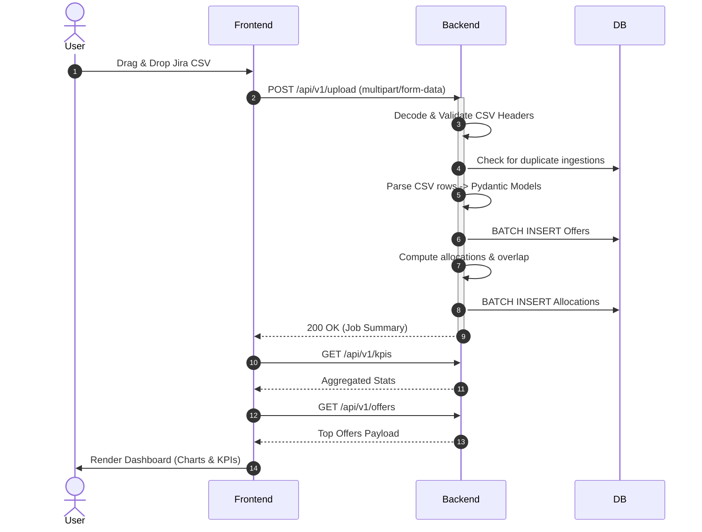
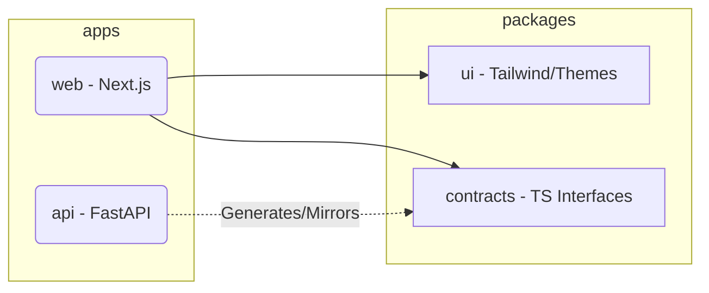

# Architecture & Data Flow

This document outlines the high-level system architecture and network topology for the Smart Offer platform.

## System Topology (Container Network)

The application runs as a cohesive Docker Compose stack on a single Docker bridge network.

```mermaid
graph TD
    classDef frontend fill:#3b82f6,stroke:#1e3a8a,color:white;
    classDef backend fill:#10b981,stroke:#064e3b,color:white;
    classDef db fill:#f59e0b,stroke:#78350f,color:white;
    classDef external fill:#6b7280,stroke:#374151,color:white;

    User[User / Web Browser]:::external
    Gemini[Google Gemini API]:::external

    subgraph Docker Bridge Network
        Frontend[Frontend Next.js Container\n:3000]:::frontend
        Backend[Backend FastAPI Container\n:8000]:::backend
        DB[(PostgreSQL Container\n:5432)]:::db
    end

    User -->|HTTP GET /| Frontend
    User -->|HTTP POST /api/v1/*| Backend
    Frontend -->|Client-side Fetch| Backend
    Backend -->|asyncpg (SSL Off)| DB
    Backend -.->|Optional AI Prompts| Gemini
```

## Data Flow: CSV Ingestion to Dashboard

The core user journey involves uploading an export from Jira to generate the dashboard.



## Monorepo Dependency Tree

How the codebase is structured locally before Dockerization:


