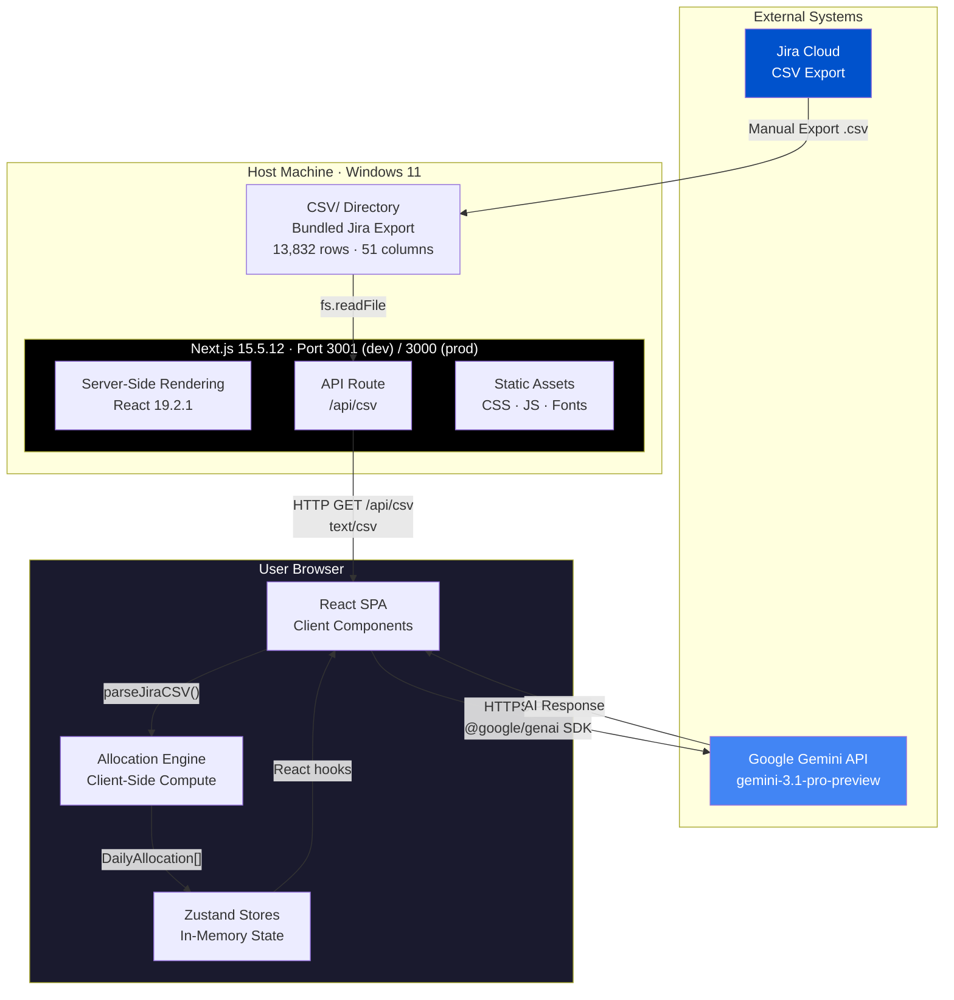
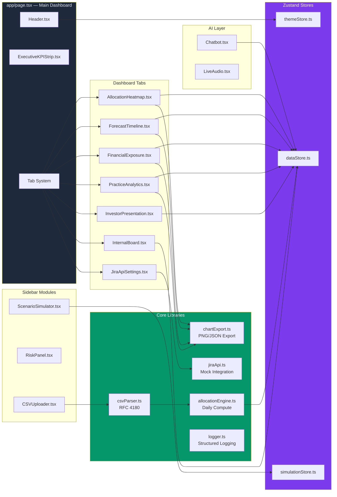
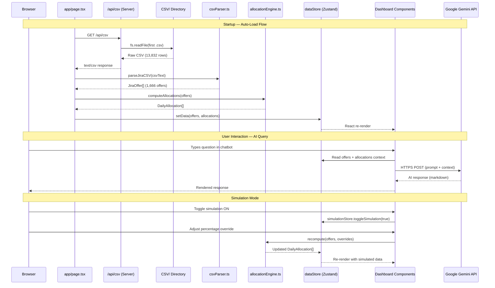
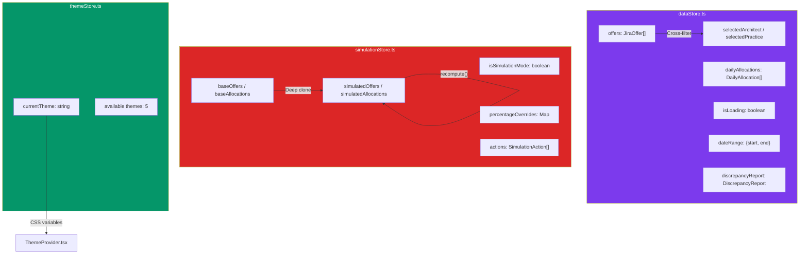
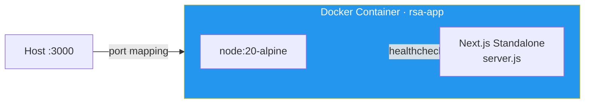
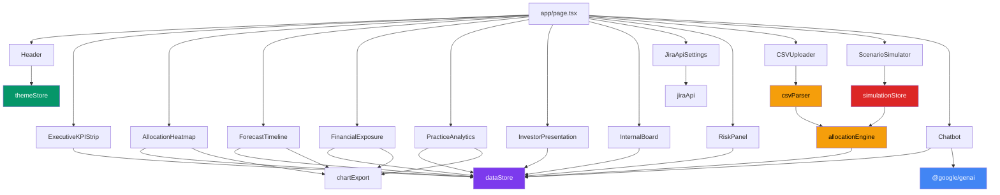

# Resource Smart Allocation — Architecture Design Document

> **Version:** 1.0 · **Date:** 2026-03-04 · **Status:** Production-Ready

---

## 1. System Overview

The Resource Smart Allocation platform is designed to operate seamlessly in a full-stack capacity, but notably supports a **front-end only deviation** where it ingests Jira CSV exports and provides real-time allocation intelligence through an interactive dashboard without requiring a live backend for data storage. There is **no mandatory external database** needed for basic visualization — data is parsed client-side and held in browser memory via Zustand stores. Data persistence features utilize the python backend and PostgreSQL database.



---

## 2. Network Topology

| Connection | Protocol | Source | Destination | Port | Auth |
|---|---|---|---|---|---|
| Dev Server | HTTP | Browser | `localhost` | **3001** | None |
| Prod Server | HTTP | Browser | `localhost` | **3000** | None |
| CSV API | HTTP GET | Browser JS | Next.js `/api/csv` | Same origin | None |
| Gemini AI | HTTPS | Browser JS | `generativelanguage.googleapis.com` | 443 | API Key (`NEXT_PUBLIC_GEMINI_API_KEY`) |
| Jira API (future) | HTTPS | Server | `*.atlassian.net` | 443 | Bearer Token (not yet wired) |
| Docker Container | HTTP | Host | Container | 3000→3000 | None |

> [!IMPORTANT]
> The Gemini API key is exposed client-side via `NEXT_PUBLIC_GEMINI_API_KEY`. The Chatbot calls Gemini directly from the browser. For production, proxy through a server-side API route.

---

## 3. Technology Stack — Full Version Inventory

### Runtime

| Component | Version | Purpose |
|---|---|---|
| Node.js | 20 (Alpine) | Server runtime (Docker base image) |
| Next.js | 15.5.12 | Full-stack React framework |
| React | 19.2.1 | UI component library |
| React DOM | 19.2.1 | DOM renderer |
| TypeScript | 5.9.3 | Type safety |

### Production Dependencies

| Package | Version | Role |
|---|---|---|
| `@google/genai` | ^1.17.0 | Gemini AI SDK for chatbot |
| `zustand` | ^5.0.11 | Client state management |
| `recharts` | ^3.7.0 | Chart visualizations |
| `d3` | ^7.9.0 | Data-driven heatmap rendering |
| `date-fns` | ^4.1.0 | Date parsing and formatting |
| `motion` (Framer) | ^12.23.24 | UI animations and transitions |
| `lucide-react` | ^0.553.0 | Icon library |
| `react-markdown` | ^10.1.0 | Markdown rendering in chatbot |
| `clsx` | ^2.1.1 | Conditional CSS class merging |
| `tailwind-merge` | ^3.5.0 | Tailwind class conflict resolution |
| `class-variance-authority` | ^0.7.1 | Component variant system |
| `autoprefixer` | ^10.4.21 | CSS vendor prefixing |
| `postcss` | ^8.5.6 | CSS processing pipeline |

### Development Dependencies

| Package | Version | Role |
|---|---|---|
| `tailwindcss` | 4.1.11 | Utility-first CSS framework |
| `@tailwindcss/postcss` | 4.1.11 | PostCSS integration |
| `@tailwindcss/typography` | ^0.5.19 | Prose styling plugin |
| `vitest` | ^4.0.18 | Unit testing framework |
| `@vitest/coverage-v8` | ^4.0.18 | Code coverage via V8 |
| `happy-dom` | ^20.8.3 | DOM simulation for tests |
| `eslint` | 9.39.1 | Code linting |
| `eslint-config-next` | 16.0.8 | Next.js ESLint rules |
| `firebase-tools` | ^15.0.0 | Deploy tooling (optional) |
| `tw-animate-css` | ^1.4.0 | Animation utilities |

---

## 4. Application Architecture — Component Map



---

## 5. Data Flow — End to End



---

## 6. File Structure

```
Resource_Smart_Allocation/
├── app/
│   ├── page.tsx                    # Main dashboard (411 lines)
│   ├── layout.tsx                  # Root layout + ThemeProvider
│   ├── globals.css                 # Global styles
│   └── api/csv/
│       └── route.ts                # GET handler — serves bundled CSV
│
├── components/
│   ├── dashboard/
│   │   ├── AllocationHeatmap.tsx    # 21-day heatmap (table/chart/graph)
│   │   ├── CSVUploader.tsx         # Drag-and-drop CSV upload
│   │   ├── ExecutiveKPIStrip.tsx   # Revenue/architects/overload KPIs
│   │   ├── FinancialExposure.tsx   # Revenue distribution + HHI index
│   │   ├── ForecastTimeline.tsx    # Capacity vs demand curve
│   │   ├── Header.tsx              # Theme switcher + nav
│   │   ├── InternalBoard.tsx       # Offer multiplicity + alerts
│   │   ├── InvestorPresentation.tsx # Scaling score + practice share
│   │   ├── JiraApiSettings.tsx     # Jira API config panel
│   │   ├── PracticeAnalytics.tsx   # Revenue by practice pie chart
│   │   └── RiskPanel.tsx           # Overload detection sidebar
│   ├── ai/
│   │   ├── Chatbot.tsx             # Gemini-powered chatbot overlay
│   │   └── LiveAudio.tsx           # Voice interaction module
│   ├── simulator/
│   │   └── ScenarioSimulator.tsx   # What-if simulation controls
│   └── theme/
│       └── ThemeProvider.tsx        # CSS variable injection
│
├── store/
│   ├── dataStore.ts                # Offers, allocations, filters
│   ├── simulationStore.ts          # Simulation state + engine
│   └── themeStore.ts               # Active theme + switcher
│
├── lib/
│   ├── parser/
│   │   └── csvParser.ts            # RFC 4180 parser (263 lines)
│   ├── engine/
│   │   ├── allocationEngine.ts     # Daily allocation compute
│   │   └── types.ts                # JiraOffer, DailyAllocation interfaces
│   ├── integrations/
│   │   └── jiraApi.ts              # Jira REST API client (mock)
│   ├── chartExport.ts              # PNG/JSON export utility
│   ├── logger.ts                   # Structured logging
│   └── utils.ts                    # Shared utilities
│
├── themes/                         # 5 JSON theme files
│   ├── mckinsey_minimal.json
│   ├── cfo_dark_premium.json       # "Bloomberg Terminal"
│   ├── war_room_mode.json          # Neon green/black
│   ├── institutional_clean.json    # "Figma Studio"
│   └── big_tech_saas.json          # "Night Ops"
│
├── CSV/                            # Bundled Jira export data
├── docs/                           # Documentation
├── Dockerfile                      # Multi-stage (node:20-alpine)
├── docker-compose.yml              # Single-service compose
├── vitest.config.ts                # 118 tests, 85% coverage
├── next.config.ts                  # Standalone output mode
└── package.json                    # Dependency manifest
```

---

## 7. Store Architecture



| Store | State Size | Update Frequency |
|---|---|---|
| `dataStore` | ~1,666 offers + ~35K daily allocations | On CSV load / filter change |
| `simulationStore` | Clone of dataStore + overrides | On simulation actions |
| `themeStore` | 1 active theme string | On theme switch |

---

## 8. Deployment Options

### Option A: Local Development (Current)

```
npm run dev → http://localhost:3001
```

### Option B: Docker Container



```bash
docker compose up -d
# → http://localhost:3000
# Health check: wget http://localhost:3000 every 30s
```

| Docker Config | Value |
|---|---|
| Base Image | `node:20-alpine` |
| Build | Multi-stage (builder → runner) |
| User | `nextjs:nodejs` (non-root, UID 1001) |
| Output | Next.js standalone mode |
| Port | 3000 |
| Restart | `unless-stopped` |
| Health Check | HTTP GET `/` every 30s, 3 retries |

### Option C: Firebase Hosting (configured but not deployed)

`firebase-tools` is installed as a dev dependency. No `firebase.json` found — would need configuration.

---

## 9. Environment Variables

| Variable | Scope | Required | Current Value |
|---|---|---|---|
| `GEMINI_API_KEY` | Server-side | Optional | `MY_GEMINI_API_KEY` (placeholder) |
| `NEXT_PUBLIC_GEMINI_API_KEY` | Client-side | Optional (for AI chatbot) | `MY_GEMINI_API_KEY` (placeholder) |
| `APP_URL` | Server-side | Optional | `MY_APP_URL` (placeholder) |
| `NODE_ENV` | Runtime | Auto-set | `development` / `production` |
| `PORT` | Docker | Auto-set | `3000` |

---

## 10. Security Considerations

| Area | Status | Notes |
|---|---|---|
| Authentication | ❌ None | No auth layer — local/internal use |
| API Key Exposure | ⚠️ Client-side | Gemini key in `NEXT_PUBLIC_*` |
| CORS | ✅ Same-origin | API route on same Next.js server |
| Docker User | ✅ Non-root | UID 1001 `nextjs` user |
| TypeScript Strict | ⚠️ Relaxed | `ignoreBuildErrors: true` in config |
| Input Validation | ✅ Parser | CSV parser validates all field types |
| No Database | ✅ | No SQL injection surface |

---

## 11. Performance Characteristics

| Metric | Value |
|---|---|
| Production Bundle | 312 kB (page) |
| CSV Parse Time | ~200ms for 13,832 rows |
| Allocation Compute | ~150ms for 1,666 offers |
| Memory (browser) | ~50 MB with full dataset |
| Test Suite | 118 tests in 1.87s |
| Coverage | 85%+ statements, 80%+ branches |
| Cold Start (Docker) | ~3s |

---

## 12. Component Dependency Graph


